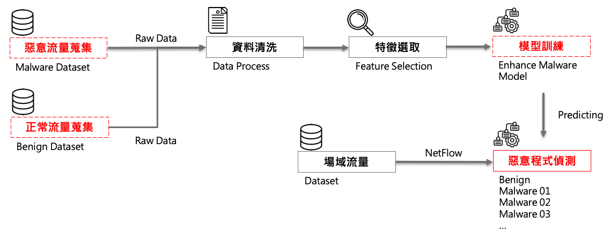

# Encrypted Traffic Analysis

## Introduction

In recent year, the encrypted technique is popular that people can use it to protect their privacy in network environment. For example, SSL/TLS is a famous cryptographic protocols designed to provide communications security over a computer network. Websites can use TLS to secure all communications between their servers and web browsers.

However, Hackers also benefit from it. They hid their behaviors and kept infiltrating companies which lacked knowledge around cybersecurity. Network administrators were hard to deal with malicious traffic and sensitive data exfiltration in an encrypted format.

Here is a method to detect malicious traffic (hackers' attack). We made use of Machine Learning to analyze traffic and classified it to benign or malware. The Figure 1. is our flow chart. We will collect benign/malware data in first. These data can be got from pcap file with a tool named [CICFlowMeter](https://github.com/ahlashkari/CICFlowMeter). This tool can be used in linux or windows operating systems, and a part of data schema from CICFlowMeter can refer to the Input Schema in Usage Section.

  
<center>Figure 1. Flow Chart of Encrypted Traffic Anaylsis</center>


Having finished our data collection, we started to process data and built a model.

1. Process data: We just simply filled na with 0 and replaced inf to 1E6.

2. Build a model:

   We selected XGBoost which is famous in GBDT as our model. To avoid overfittng, "Stratified K Fold Cross Validation" is used in modeling. The parameter optimization was implied by "Grid Search" and "Stratified K Fold Cross Validation". We choosed the best parameters from all 54 (3 kinds of learning_rate, 3 kinds of max_depth, and 6 kinds of n_estimators; parameters can be adjusted in need) combinations of parameters. Then an initial model will be fitted with the best parameters, and we filter out useless features by feature importance of the initial model. Finally, we got a best model with important features and best parameters.

In our experiment, the model is a multiclass model, which can classify traffic to one of 11 classes (Dridex, EITest, Emotet, HTBot, Hancitor, Nuclear, Razy, Rig, TrickBot, Benign, and wannacry). In addition, the macro precision and macro recall are 98.57% and 95.45%, respectively. 

Encrypted Traffic Analysis is an interesting theme, we can observe different behaviors of malware. Most importantly, it can timely detect malicious behaviors, and help MIS quickly find the malicious event. This project supplied an example code, hoping anyone interested join us to develop this technique.


## Usage

### Prerequest

An `Python3` environment. If you want to run it on docker, `python:3.8.5-buster`(gcc is needed) is recommended.

### Install library with pip
You can use `pip3 install` to install packages below, or you can use `pip3 install -r requirements.txt` to finish it.

- xgboost==1.2.0
- scikit-learn==0.23.2
- numpy==1.19.1
- pandas==1.1.2
- Flask==1.1.2
- elasticsearch==7.9.1

### Run Code

Programs can be divided to training phase and application phase. In first time, you need to run `training.py` before `predicting.py`, and the input data can refer to 'Inupt Schema'.

#### Training Phase

```
python3 training.py -f PATH/file.csv
```

#### Application Phase

```
python3 predicting.py -f PATH/file.csv
```

### Input Schema

Key                            | Value
-------------------------------|---------------
Src Port                       | 59175
Dst Port                       | 9201
Protocol                       | 6
Fwd IAT Min                    | 24.0
Fwd IAT Max                    | 25006.0
Fwd IAT Mean                   | 6960.75
Fwd IAT Std                    | 12053.697893869195
Bwd IAT Min                    | 3705.0
Bwd IAT Max                    | 19513.0
Bwd IAT Mean                   | 11609.0
Bwd IAT Std                    | 11177.943996996943
Flow IAT Min                   | 24.0
Flow IAT Max                   | 19513.0
Flow IAT Mean                  | 3977.5714285714284
Flow IAT Std                   | 6941.2158602832405
Flow Bytes/s                   | 107962.50404051288
Flow Packets/s                 | 287.32536005459184
Flow Duration                  | 27843
Total Fwd Packet               | 5
Total Bwd packets              | 3
Fwd BYTES Min                  | 54
Fwd BYTES Max                  | 1514
Fwd BYTES Mean                 | 716.1428571428571
Fwd BYTES Std                  | 751.1059464929983
Bwd BYTES Min                  | 60
Bwd BYTES Max                  | 377
Bwd BYTES Mean                 | 218.5
Bwd BYTES Std                  | 224.15284963613556
Fwd 2 Bwd Total                | 2
Bwd 2 Fwd Total                | 2
Fwd b_p BCD Min                | 66
Fwd b_p BCD Max                | 978
Fwd b_p BCD Mean               | 522
Fwd b_p BCD Std                | 644.8813844421313
Bwd b_p BCD Min                | 66
Bwd b_p BCD Max                | 218
Bwd b_p BCD Mean               | 142
Bwd b_p BCD Std                | 107.48023074035522
Fwd TTL Total                  | 896
Bwd TTL Total                  | 126
Total IP Length of Fwd Packet  | 4915
Total IP Length of Bwd Packet  | 403
byte_0                         | 0
byte_1                         | 0
...                            | ...
byte_255                       | 0


### Output Schema

Key                 | Value
--------------------|---------------
id                  | XyPZBXEBOI2XA3yCwRPD
timestamp           | 2020-03-23T13:24:39.144408+08:00
event_type          | alert
alert.category      | Dridex
alert.severity      | 2
alert.signature     | CSTI ETA - Dridex
src_ip              | 192.168.70.196
dest_ip             | 192.168.70.1
src_port            | 138
dest_port           | 138
alert.action        | 0
proto               | tcp
module              | ETA
alert.signature_id  | 20130001
log_type            | traffic
reference           | 0
alert.gid           | 0
dump_status         | 0
ingest_timestamp    | 2020-03-23T05:24:39.144408Z
